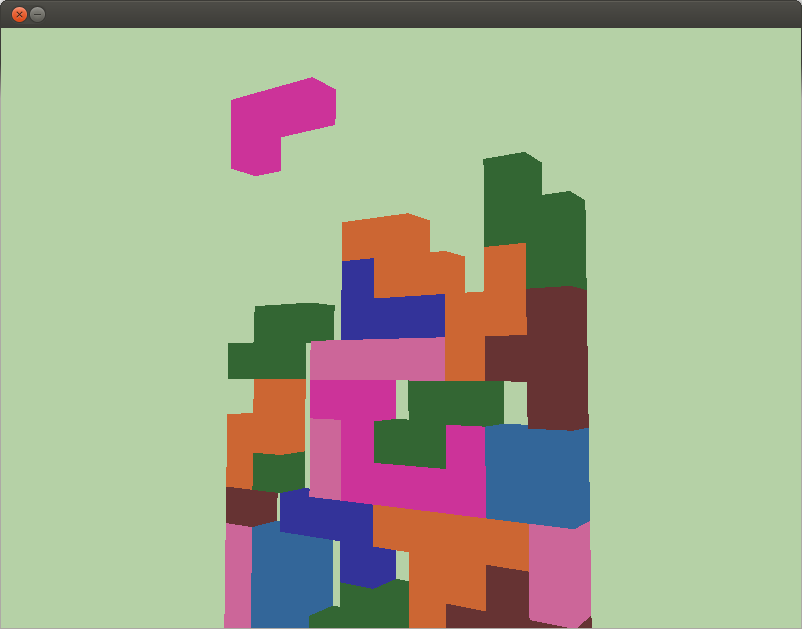

README
======

Daniel 'MaTachi' Jonsson

The code is based on the n00b tutorials found on
[opengl-tutorials.org](http://www.opengl-tutorial.org/). [Tutorial: OpenGL 3.1
The First Triangle
(C++/Win)](http://www.opengl.org/wiki/Tutorial:_OpenGL_3.1_The_First_Triangle_%28C%2B%2B/Win%29)
was also useful.

The development was done on Ubuntu 12.10. The [CMake config
file](CMakeLists.txt) hasn't been configured to work on Windows, or even tested
on Windows, so with 99.99 % probability it won't compile there.  
The shaders are written in GLSL 1.30, so it's runnable on Intel HD3000. It's
also confirmed to work with newer/better GPUs, more specifically Nvidia 660.

## Directories

* **/common**: Contains code from opengl-tutorials.org. However, most of the
  files are probably unnecessary in this project's context and could be
deleted. The original files can be found
[here](http://code.google.com/p/opengl-tutorial-org/source/browse/#hg%2Fcommon).
* **/external**: Contains the libraries GLEW, GLM, GLFW and VRAC
  Cmake Modules. The latter two are probably not needed in this project's
context, but were also included from
[opengl-tutorial.org](http://code.google.com/p/opengl-tutorial-org/source/browse/external).
* **/**: Files mostly written by myself.

## Compile

Install dependencies for compiling: `sudo apt-get install cmake build-essential
mesa-common-dev libgl1-mesa-dev libglu1-mesa-dev libxrandr-dev libsdl1.2dev`  
(Not completely sure if mesa-common-dev actually is needed)

First time configuration: `mkdir build ; cd build ; cmake .. ; cd ..`

How to compile and run the game: `cd build/ ; make ; cd .. ; ./build/Main`

## Controls

* **Left arrow key**: Move block left.
* **Right arrow key**: Move block right.
* **Up arrow key**: Rotate block.
* **Down arrow key**: Move down block instantaneously.
* **Mouse**: Change camera direction.
* **W/A/S/D**: Move around the camera.
* **E/Q**: Increase/Decrease FoV (field of view).
* **Escape**: Close the game with the escape key.

